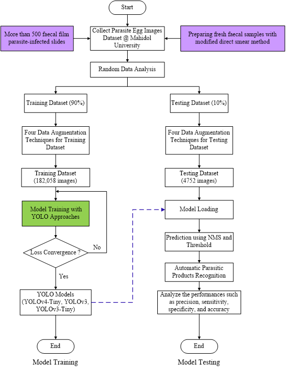

# Parasitic-Products-Recognition
Automatic Recognition of Parasitic Products in Stool Examination Using Object Detection Approach

YOLO-based model flowchart for training and testing process of Parasite Products Recognition
